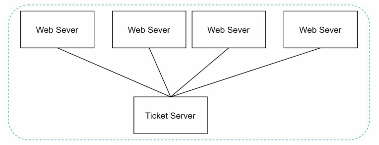

# Chapter 7: DESIGN A UNIQUE ID GENERATOR IN DISTRIBUTED SYSTEMS

## Overview

In this chapter, you are asked to design a unique ID generator in distributed systems.

> The primary key with the auto\_increment attribute in a traditional database does not work in a distributed environment because a single database server is not large enough and generating unique IDs across multiple databases with minimal delay is challenging

## Step 1 - Understand the problem and establish design scope

> Must be unique ID? ID increment by 1? ID only contain numbers? ID length? Sc ale of the system?

* Unique and sortable
* Increment by time
* Only numbers
* Length fits into 64-bit
* System should be able to generate 10,000 IDs per second.

## Step 2 - Propose high-level design and get buy-in

Multiple options can be used to generate unique IDs in distributed systems:

1. Multi-master replication
2. Universally unique identifier (UUID)
3. Ticket server
4. Twitter snowflake approach

### Multi-master replication

Increase ID by k, where k is the number of database servers.

**Drawbacks**:

* Hard to scale with multiple data centers
* IDs do not go up with time across multiple servers.
* It does not scale well when a server is added or removed.

### Universally unique identifier (UUID)

UUID is a 128-bit number. It has a very low probability of getting collusion. UUIDs can be\
generated independently without coordination between servers

**Pros**:

* Simple. No coordination between servers is needed, so no synchronization issues.
* Easy to scale because each web server is responsible for generating IDs they consume. ID generator can easily scale with web servers.

**Cons**:

* IDs are 128 bits long, but our requirement is 64 bits.
* IDs do not go up with time.
* IDs could be non-numeric.

### Ticket server

> How does it work?

<figure><figcaption></figcaption></figure>

It use a centralized auto\_increment feature in a single database server.

**Pros**:

* Numeric IDs.
* Easy to implement, and it works for small to medium-scale applications.

**Cons**:

* Single point of failure. To avoid a single point of failure, we can set up multiple ticket servers. However, this will introduce new challenges such as data synchronization.

### Twitter snowflake approach

Instead of generating an ID directly, we divide an ID into different sections

<figure><figcaption></figcaption></figure>

Each section is explained below.

* **Sign bit**: 1 bit. It will always be 0. This is reserved for future use. It can potentially be used to distinguish between **signed and unsigned numbers**.
* **Timestamp**: 41 bits. Milliseconds since the **epoch or custom epoch**. We use Twitter snowflake default epoch 1288834974657, equivalent to Nov 04, 2010, 01:42:54 UTC.
* **Datacenter ID**: 5 bits, which gives us 2 ^ 5 = 32 datacenters.
* **Machine ID**: 5 bits, which gives us 2 ^ 5 = 32 machines per datacenter.
* **Sequence number**: 12 bits. For every ID generated on that machine/process, the sequence number is **incremented by 1**. The number is reset to 0 every millisecond.

### Step 3 - Design Deep Dive

Datacenter IDs and machine IDs are chosen at startup time, fixed once the system is up and running.

#### Timestamp:

* As timestamps grow with time, IDs are sortable by time
* The image shows how binary representation is converted to UTC. You can also convert UTC back to binary representation using a similar method

<figure><figcaption></figcaption></figure>

> The maximum timestamp that can be represented in 41 bits is:
>
> 2 ^ 41 - 1 = 2199023255551 milliseconds (ms), which gives us: \~ 69 years = 2199023255551 ms / 1000 seconds / 365 days / 24 hours/ 3600 seconds.&#x20;
>
> This means the ID generator will work for 69 years and having a custom epoch time close to today’s date delays the overflow time

#### Sequence number

The sequence number is 12 bits, which gives us 2 ^ 12 = 4096 combinations. This field is 0 unless\
more than one ID is generated in a millisecond on the same server. In theory, a machine can\
support a maximum of 4096 new IDs per millisecond

## Step 4 - Wrap up

Additional talking points:

* Clock synchronization. In our design, we assume ID generation servers have the same clock. This assumption might not be true when a server is running on multiple cores. The same challenge exists in multi-machine scenarios. Solutions to clock synchronization are out of the scope of this book; however, it is important to understand the problem exists. Network Time Protocol is the most popular solution to this problem.
* Section length tuning. For example, fewer sequence numbers but more timestamp bits are effective for low concurrency and long-term applications.
* High availability. Since an ID generator is a mission-critical system, it must be highly available.
